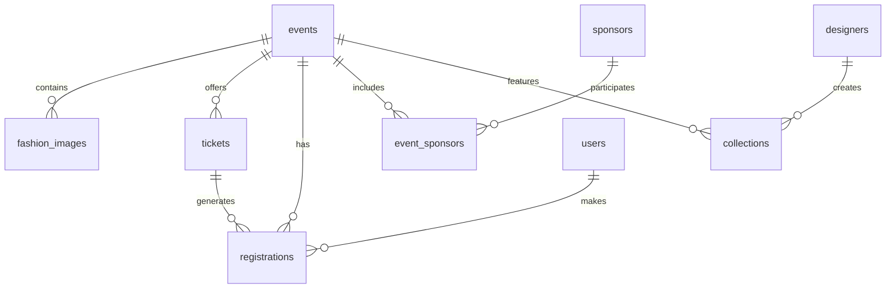

# Fashionistas Data Architecture Guide

## 1. Database Architecture Overview

### Core Database Structure


### Primary Tables & Relationships

#### Event Management
- `events`
  - Primary event information
  - Status tracking (draft → published → completed)
  - Venue and capacity management
  - Event metadata and SEO information

- `fashion_images`
  - Event-related imagery
  - Category-based organization
  - Metadata for optimization

- `collections`
  - Designer collections for events
  - Piece tracking and management
  - Collection metadata

#### User & Access Management
- `users`
  - Core user information
  - Role-based access control
  - Authentication details
  - Profile management

- `roles`
  - Role definitions
  - Permission mappings
  - Access level control

- `permissions`
  - Granular permission definitions
  - Feature access control
  - Action-based restrictions

#### Ticketing System
- `tickets`
  - Ticket tier definitions
  - Pricing and availability
  - Benefits and features
  - Dynamic allocation rules

- `registrations`
  - Ticket purchases
  - Attendee information
  - Payment status
  - Check-in tracking

#### Sponsorship Management
- `sponsors`
  - Sponsor organization details
  - Contact information
  - Engagement history

- `event_sponsors`
  - Event-specific sponsorships
  - Tier and benefit tracking
  - Contribution management

## 2. Data Schema Enhancements

### New Table Recommendations

#### Analytics & Tracking
```sql
CREATE TABLE event_analytics (
    id UUID PRIMARY KEY DEFAULT uuid_generate_v4(),
    event_id UUID REFERENCES events(id),
    page_views INTEGER DEFAULT 0,
    ticket_views INTEGER DEFAULT 0,
    cart_additions INTEGER DEFAULT 0,
    successful_purchases INTEGER DEFAULT 0,
    created_at TIMESTAMPTZ DEFAULT NOW(),
    updated_at TIMESTAMPTZ DEFAULT NOW()
);

CREATE TABLE user_engagement (
    id UUID PRIMARY KEY DEFAULT uuid_generate_v4(),
    user_id UUID REFERENCES users(id),
    event_id UUID REFERENCES events(id),
    engagement_type TEXT,
    duration INTEGER,
    created_at TIMESTAMPTZ DEFAULT NOW()
);
```

#### Enhanced Ticket Management
```sql
CREATE TABLE ticket_allocations (
    id UUID PRIMARY KEY DEFAULT uuid_generate_v4(),
    ticket_id UUID REFERENCES tickets(id),
    allocation_type TEXT,
    quantity INTEGER,
    reserved_for UUID REFERENCES users(id),
    expires_at TIMESTAMPTZ,
    created_at TIMESTAMPTZ DEFAULT NOW()
);

CREATE TABLE ticket_benefits (
    id UUID PRIMARY KEY DEFAULT uuid_generate_v4(),
    ticket_id UUID REFERENCES tickets(id),
    benefit_name TEXT,
    benefit_description TEXT,
    is_active BOOLEAN DEFAULT true,
    created_at TIMESTAMPTZ DEFAULT NOW()
);
```

### Schema Optimizations

#### Indexing Strategy
```sql
-- Event Performance Optimization
CREATE INDEX idx_events_status_date ON events(status, start_time);
CREATE INDEX idx_events_venue_capacity ON events(venue, capacity);

-- Ticket Sales Optimization
CREATE INDEX idx_tickets_availability ON tickets(event_id, quantity_available);
CREATE INDEX idx_registrations_status ON registrations(status, created_at);

-- User Access Optimization
CREATE INDEX idx_user_roles ON users(role);
CREATE INDEX idx_permissions_feature ON permissions(feature_name);
```

## 3. Security Implementation

### Row Level Security (RLS)

```sql
-- Event Access Policies
ALTER TABLE events ENABLE ROW LEVEL SECURITY;

CREATE POLICY event_view_policy ON events
    FOR SELECT
    USING (
        status = 'published' OR 
        auth.uid() IN (
            SELECT user_id FROM event_organizers 
            WHERE event_id = events.id
        )
    );

-- Ticket Access Policies
ALTER TABLE tickets ENABLE ROW LEVEL SECURITY;

CREATE POLICY ticket_purchase_policy ON tickets
    FOR SELECT
    USING (
        quantity_available > 0 AND
        current_timestamp < events.registration_deadline
    );
```

### Role-Based Access Control

```sql
-- Role Definitions
CREATE TYPE user_role AS ENUM (
    'admin',
    'organizer',
    'sponsor',
    'designer',
    'model',
    'attendee'
);

-- Permission Mappings
CREATE TABLE role_permissions (
    role user_role,
    permission TEXT,
    access_level TEXT,
    PRIMARY KEY (role, permission)
);
```

## 4. API Structure

### Core Endpoints

#### Event Management
```typescript
interface EventEndpoints {
    '/events': {
        GET: ListEvents;
        POST: CreateEvent;
    };
    '/events/:id': {
        GET: GetEventDetails;
        PUT: UpdateEvent;
        DELETE: DeleteEvent;
    };
    '/events/:id/analytics': {
        GET: GetEventAnalytics;
    };
}
```

#### Ticketing
```typescript
interface TicketEndpoints {
    '/tickets': {
        GET: ListTickets;
        POST: CreateTicket;
    };
    '/tickets/:id/purchase': {
        POST: PurchaseTicket;
    };
    '/tickets/allocations': {
        POST: AllocateTickets;
        PUT: UpdateAllocation;
    };
}
```

#### Sponsorship
```typescript
interface SponsorEndpoints {
    '/sponsors': {
        GET: ListSponsors;
        POST: CreateSponsor;
    };
    '/sponsors/:id/benefits': {
        GET: GetSponsorBenefits;
        PUT: UpdateBenefits;
    };
}
```

## 5. Integration Points

### External Service Integration

#### Payment Processing (Stripe)
```typescript
interface PaymentIntegration {
    createPaymentIntent(amount: number, currency: string): Promise<string>;
    processRefund(paymentId: string): Promise<void>;
    handleWebhook(event: WebhookEvent): Promise<void>;
}
```

#### Media Management (Cloudinary)
```typescript
interface MediaIntegration {
    uploadImage(file: File, options: UploadOptions): Promise<string>;
    optimizeImage(url: string, params: OptimizationParams): string;
    generateTransformation(config: TransformationConfig): string;
}
```

#### Communication (WhatsApp Business API)
```typescript
interface CommunicationIntegration {
    sendTicketConfirmation(phone: string, ticketDetails: TicketDetails): Promise<void>;
    sendEventReminder(phone: string, eventDetails: EventDetails): Promise<void>;
    handleStatusUpdate(messageId: string, status: MessageStatus): Promise<void>;
}
```

## 6. Performance Optimization

### Caching Strategy
```typescript
interface CacheConfig {
    eventCache: {
        ttl: 3600,  // 1 hour
        invalidationTriggers: ['event_update', 'ticket_purchase']
    };
    ticketCache: {
        ttl: 300,   // 5 minutes
        invalidationTriggers: ['purchase', 'allocation_update']
    };
    sponsorCache: {
        ttl: 7200,  // 2 hours
        invalidationTriggers: ['sponsor_update', 'benefit_change']
    };
}
```

### Query Optimization
```sql
-- Materialized Views for Analytics
CREATE MATERIALIZED VIEW event_statistics AS
    SELECT 
        e.id,
        e.title,
        COUNT(DISTINCT r.id) as total_registrations,
        SUM(t.price) as total_revenue,
        COUNT(DISTINCT s.id) as sponsor_count
    FROM events e
    LEFT JOIN registrations r ON e.id = r.event_id
    LEFT JOIN tickets t ON r.ticket_id = t.id
    LEFT JOIN event_sponsors s ON e.id = s.event_id
    GROUP BY e.id, e.title;

-- Refresh Schedule
REFRESH MATERIALIZED VIEW event_statistics
    WITH DATA
    CONCURRENTLY;
```

## 7. Monitoring & Analytics

### Performance Metrics
```typescript
interface MonitoringConfig {
    metrics: {
        queryPerformance: {
            slowQueryThreshold: 1000,  // ms
            indexUsageThreshold: 0.8
        };
        apiPerformance: {
            responseTimeThreshold: 200,  // ms
            errorRateThreshold: 0.01
        };
        systemHealth: {
            cpuThreshold: 80,  // percentage
            memoryThreshold: 85,  // percentage
            diskSpaceThreshold: 90  // percentage
        };
    };
}
```

### Audit Logging
```sql
CREATE TABLE audit_logs (
    id UUID PRIMARY KEY DEFAULT uuid_generate_v4(),
    user_id UUID REFERENCES users(id),
    action TEXT,
    entity_type TEXT,
    entity_id UUID,
    changes JSONB,
    ip_address INET,
    created_at TIMESTAMPTZ DEFAULT NOW()
);

CREATE INDEX idx_audit_user_action ON audit_logs(user_id, action);
CREATE INDEX idx_audit_entity ON audit_logs(entity_type, entity_id);
```

## 8. Backup & Recovery

### Backup Strategy
```typescript
interface BackupConfig {
    frequency: {
        full: '24h',
        incremental: '1h'
    };
    retention: {
        daily: '7d',
        weekly: '4w',
        monthly: '12m'
    };
    locations: {
        primary: 's3://fashionistas-backup',
        secondary: 's3://fashionistas-backup-dr'
    };
}
```

### Recovery Procedures
```typescript
interface RecoveryConfig {
    pointInTimeRecovery: {
        enabled: true,
        granularity: '5m'
    };
    failover: {
        automaticFailover: true,
        maxDowntime: '30s'
    };
    dataValidation: {
        checksumValidation: true,
        consistencyChecks: true
    };
}
```

## 9. Future Considerations

### Scalability Planning
- Implement database sharding for events data
- Add read replicas for high-traffic periods
- Implement distributed caching
- Consider event sourcing for complex workflows
- Plan for multi-region deployment

### Feature Expansion
- AI-powered ticket pricing optimization
- Real-time analytics dashboard
- Advanced fraud detection
- Enhanced sponsor engagement tracking
- Automated marketing campaign integration

### Compliance & Security
- GDPR data handling requirements
- PCI DSS compliance for payments
- Data retention policies
- Privacy-focused data architecture
- Regular security audits 

## 10. Implementation Requirements & Roadmap

### 10.1 System Requirements Analysis

#### Performance Targets
```typescript
interface PerformanceRequirements {
    transactionVolume: {
        monthly: 1000,              // Base requirement
        hourlyPeak: 10000,         // Peak capacity
        concurrentUsers: 1000      // Simultaneous users
    };
    responseTimes: {
        databaseQuery: 100,        // ms
        apiResponse: 200,          // ms
        realtimeUpdates: 500      // ms
    };
    availability: {
        uptime: 99.9,             // Percentage
        dataLoss: 0,              // Zero tolerance
        failoverTime: 30          // seconds
    };
}
```

#### Integration Requirements
```typescript
interface SystemIntegrations {
    paymentProcessing: {
        provider: 'Stripe',
        features: [
            'payment_intents',
            'refunds',
            'disputes',
            'webhooks'
        ]
    };
    eventManagement: {
        provider: 'Hi.Events',
        features: [
            'event_creation',
            'ticket_management',
            'attendee_tracking'
        ]
    };
    notifications: {
        provider: 'WATI',
        features: [
            'whatsapp_notifications',
            'bulk_messaging',
            'template_messages'
        ]
    };
    mediaManagement: {
        provider: 'Cloudinary',
        features: [
            'image_upload',
            'optimization',
            'transformation'
        ]
    };
    crm: {
        provider: 'Twenty.com',
        features: [
            'contact_management',
            'lead_tracking',
            'engagement_analytics'
        ]
    };
}
```

### 10.2 Enhanced Database Schema

#### Event Lifecycle Management
```sql
-- Event Status Tracking
CREATE TYPE event_status AS ENUM (
    'draft',
    'review',
    'published',
    'on_sale',
    'sold_out',
    'in_progress',
    'completed',
    'cancelled'
);

-- Event Status History
CREATE TABLE event_status_history (
    id UUID PRIMARY KEY DEFAULT uuid_generate_v4(),
    event_id UUID REFERENCES events(id),
    previous_status event_status,
    new_status event_status,
    changed_by UUID REFERENCES users(id),
    reason TEXT,
    created_at TIMESTAMPTZ DEFAULT NOW()
);

-- Event Capacity Management
CREATE TABLE event_capacity (
    id UUID PRIMARY KEY DEFAULT uuid_generate_v4(),
    event_id UUID REFERENCES events(id),
    ticket_type_id UUID REFERENCES ticket_types(id),
    total_capacity INTEGER,
    reserved_capacity INTEGER DEFAULT 0,
    sold_capacity INTEGER DEFAULT 0,
    waitlist_capacity INTEGER DEFAULT 0,
    last_updated TIMESTAMPTZ DEFAULT NOW()
);
```

#### Enhanced Ticket Management
```sql
-- Ticket Types with Dynamic Pricing
CREATE TABLE ticket_types (
    id UUID PRIMARY KEY DEFAULT uuid_generate_v4(),
    event_id UUID REFERENCES events(id),
    name TEXT NOT NULL,
    description TEXT,
    base_price DECIMAL(10,2),
    current_price DECIMAL(10,2),
    price_history JSONB,
    quantity_total INTEGER,
    quantity_sold INTEGER DEFAULT 0,
    quantity_reserved INTEGER DEFAULT 0,
    sales_start TIMESTAMPTZ,
    sales_end TIMESTAMPTZ,
    early_bird_deadline TIMESTAMPTZ,
    early_bird_price DECIMAL(10,2),
    group_discount_threshold INTEGER,
    group_discount_percentage DECIMAL(5,2),
    is_active BOOLEAN DEFAULT true,
    created_at TIMESTAMPTZ DEFAULT NOW(),
    updated_at TIMESTAMPTZ DEFAULT NOW()
);

-- Ticket Allocations for Special Groups
CREATE TABLE ticket_allocations (
    id UUID PRIMARY KEY DEFAULT uuid_generate_v4(),
    ticket_type_id UUID REFERENCES ticket_types(id),
    allocation_group TEXT NOT NULL,
    quantity INTEGER NOT NULL,
    reserved_until TIMESTAMPTZ,
    created_by UUID REFERENCES users(id),
    created_at TIMESTAMPTZ DEFAULT NOW()
);

-- Ticket Purchase Transactions
CREATE TABLE ticket_transactions (
    id UUID PRIMARY KEY DEFAULT uuid_generate_v4(),
    ticket_type_id UUID REFERENCES ticket_types(id),
    user_id UUID REFERENCES users(id),
    quantity INTEGER NOT NULL,
    unit_price DECIMAL(10,2),
    total_amount DECIMAL(10,2),
    payment_intent_id TEXT,
    payment_status payment_status,
    created_at TIMESTAMPTZ DEFAULT NOW(),
    updated_at TIMESTAMPTZ DEFAULT NOW()
);
```

### 10.3 Real-time Updates Implementation

#### WebSocket Configuration
```typescript
interface WebSocketConfig {
    endpoints: {
        ticketUpdates: '/ws/tickets',
        eventUpdates: '/ws/events',
        adminUpdates: '/ws/admin'
    };
    channels: {
        ticketAvailability: {
            event: 'ticket_availability_changed',
            payload: {
                eventId: string;
                ticketTypeId: string;
                availableQuantity: number;
                lastUpdated: string;
            }
        };
        eventStatus: {
            event: 'event_status_changed',
            payload: {
                eventId: string;
                newStatus: EventStatus;
                timestamp: string;
            }
        };
    };
    security: {
        authRequired: true,
        rateLimit: {
            messages: 100,
            interval: '1m'
        }
    };
}
```

### 10.4 Implementation Roadmap

#### Phase 1: Foundation (Weeks 1-4)
- **Priority: CRITICAL**
- **Complexity: HIGH**
```typescript
interface Phase1Tasks {
    database: [
        'Initialize Supabase project',
        'Set up base tables and relationships',
        'Implement RLS policies',
        'Configure backup strategy'
    ];
    authentication: [
        'Set up user authentication',
        'Implement RBAC',
        'Configure session management'
    ];
    api: [
        'Create core API endpoints',
        'Implement rate limiting',
        'Set up error handling'
    ];
}
```

#### Phase 2: Core Features (Weeks 5-8)
- **Priority: HIGH**
- **Complexity: MEDIUM**
```typescript
interface Phase2Tasks {
    ticketing: [
        'Implement ticket management system',
        'Set up payment processing',
        'Create allocation system'
    ];
    events: [
        'Build event management workflows',
        'Implement status tracking',
        'Set up notifications'
    ];
    realtime: [
        'Configure WebSocket connections',
        'Implement real-time updates',
        'Set up caching'
    ];
}
```

#### Phase 3: Integration & Enhancement (Weeks 9-12)
- **Priority: MEDIUM**
- **Complexity: MEDIUM**
```typescript
interface Phase3Tasks {
    integrations: [
        'Set up Stripe integration',
        'Configure WATI notifications',
        'Implement Cloudinary',
        'Set up Twenty.com CRM'
    ];
    analytics: [
        'Implement tracking system',
        'Set up reporting',
        'Configure dashboards'
    ];
    optimization: [
        'Performance tuning',
        'Query optimization',
        'Cache implementation'
    ];
}
```

#### Phase 4: Testing & Deployment (Weeks 13-16)
- **Priority: HIGH**
- **Complexity: MEDIUM**
```typescript
interface Phase4Tasks {
    testing: [
        'Unit testing',
        'Integration testing',
        'Load testing',
        'Security testing'
    ];
    deployment: [
        'Staging environment setup',
        'Production environment setup',
        'Monitoring configuration'
    ];
    documentation: [
        'API documentation',
        'System documentation',
        'User guides'
    ];
}
```

### 10.5 Testing Strategy

#### Performance Testing
```typescript
interface PerformanceTestPlan {
    loadTesting: {
        scenarios: [
            {
                name: 'Peak ticket sales',
                users: 1000,
                duration: '1h',
                actions: [
                    'Browse events',
                    'Select tickets',
                    'Complete purchase'
                ]
            }
        ];
        metrics: [
            'Response time',
            'Error rate',
            'Transaction throughput'
        ];
    };
    stressTest: {
        scenarios: [
            {
                name: 'Maximum capacity',
                users: 10000,
                duration: '30m',
                rampUp: '5m'
            }
        ];
    };
}
```

#### Security Testing
```typescript
interface SecurityTestPlan {
    penetrationTesting: [
        'Authentication bypass attempts',
        'SQL injection testing',
        'XSS vulnerability scanning',
        'CSRF protection validation'
    ];
    dataValidation: [
        'Input sanitization',
        'Output encoding',
        'File upload validation',
        'Payment data handling'
    ];
    accessControl: [
        'Role permission verification',
        'Resource access validation',
        'Session management testing'
    ];
}
```

### 10.6 Monitoring & Alerts

#### System Monitoring
```typescript
interface MonitoringSetup {
    metrics: {
        system: [
            'CPU usage',
            'Memory utilization',
            'Disk space',
            'Network traffic'
        ];
        application: [
            'Response times',
            'Error rates',
            'Active users',
            'Transaction volume'
        ];
        database: [
            'Query performance',
            'Connection pool status',
            'Lock waiting',
            'Index usage'
        ];
    };
    alerts: {
        critical: {
            responseTime: '>500ms',
            errorRate: '>1%',
            diskSpace: '>90%'
        };
        warning: {
            responseTime: '>200ms',
            errorRate: '>0.1%',
            diskSpace: '>80%'
        };
    };
}
``` 