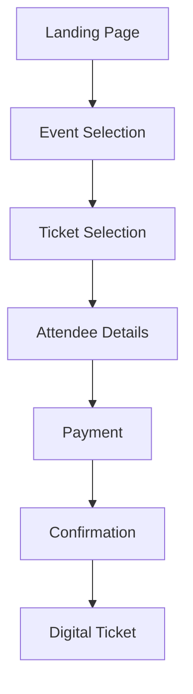
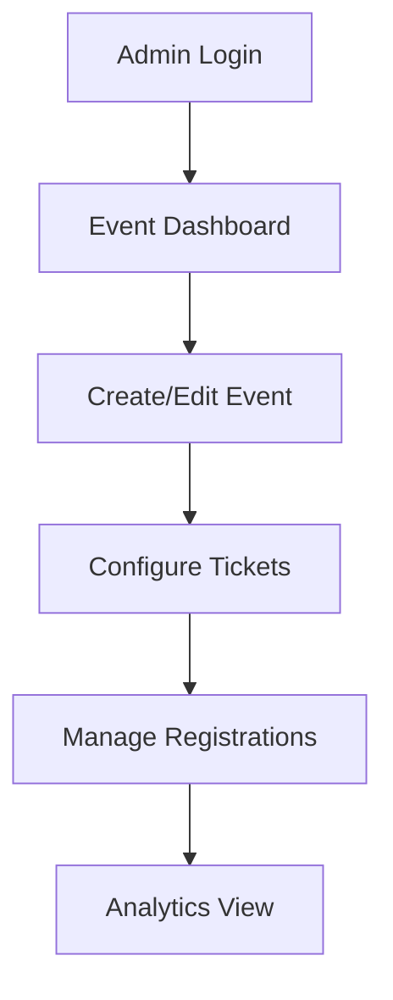
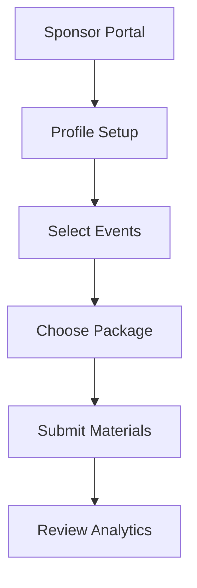

# User Flows & Journey Documentation

## Core Principles

- **Mobile-First Design**: Optimized for smartphone users
- **Progressive Enhancement**: Core functionality works across all devices
- **Accessibility**: WCAG 2.1 AA compliance
- **Performance**: Sub-2 second page loads
- **Security**: PCI-DSS compliant payment processing
- **Analytics**: Full funnel tracking

## 1. Ticket Purchase Journey

### Overview
The ticket purchase flow is the primary conversion path for the platform, optimized for maximum conversion and user satisfaction.

### Flow Diagram


### Implementation Details
```typescript
interface TicketPurchaseJourney {
  steps: {
    landing: {
      entry_points: string[];
      conversion_goals: string[];
      exit_points: string[];
    };
    eventSelection: {
      filters: string[];
      sorting_options: string[];
      search_capabilities: string[];
    };
    ticketSelection: {
      pricing_display: string[];
      availability_check: boolean;
      seat_selection?: boolean;
    };
    attendeeDetails: {
      required_fields: string[];
      validation_rules: Record<string, string>;
      save_for_later: boolean;
    };
    payment: {
      supported_methods: string[];
      security_measures: string[];
      timeout_handling: boolean;
    };
    confirmation: {
      email_notification: boolean;
      download_options: string[];
      share_options: string[];
    };
  };
}
```

## 2. Event Management Journey

### Flow Diagram


### Implementation Details
```typescript
interface EventManagementJourney {
  roles: string[];
  permissions: Record<string, string[]>;
  features: string[];
}
```

## 3. Sponsor Management Journey

### Flow Diagram


## 4. Testing Scenarios

### Ticket Purchase Testing
- Valid purchase flow
- Out-of-stock handling
- Payment failure recovery
- Promo code application
- Group booking process
- Refund workflow

### Event Management Testing
- Event creation
- Ticket configuration
- Capacity management
- Schedule updates
- Image upload
- Analytics access

### Error Scenarios
- Network failure handling
- Session timeout recovery
- Invalid input handling
- Payment processing errors
- Concurrent booking conflicts

## 5. Analytics & Tracking

### Key Metrics
- Conversion rate by entry point
- Drop-off points
- Average session duration
- Payment success rate
- User satisfaction score

### Event Tracking
```typescript
interface TrackingEvents {
  page_view: string;
  button_click: string;
  form_submit: string;
  error_encounter: string;
  purchase_complete: string;
}
```

## 6. Mobile Considerations

### Responsive Breakpoints
- Mobile: 320px - 480px
- Tablet: 481px - 768px
- Desktop: 769px+

### Mobile-Specific Features
- Touch-friendly interfaces
- Simplified navigation
- Offline support
- Native share integration
- Mobile payment options 